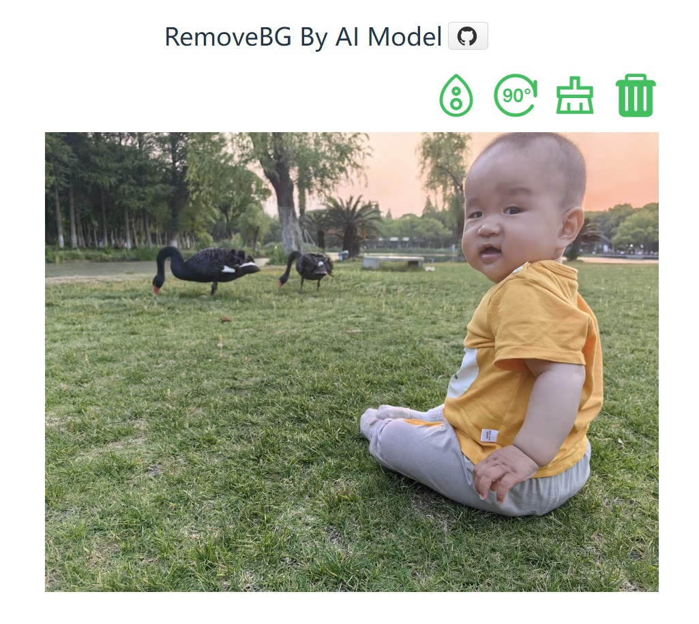
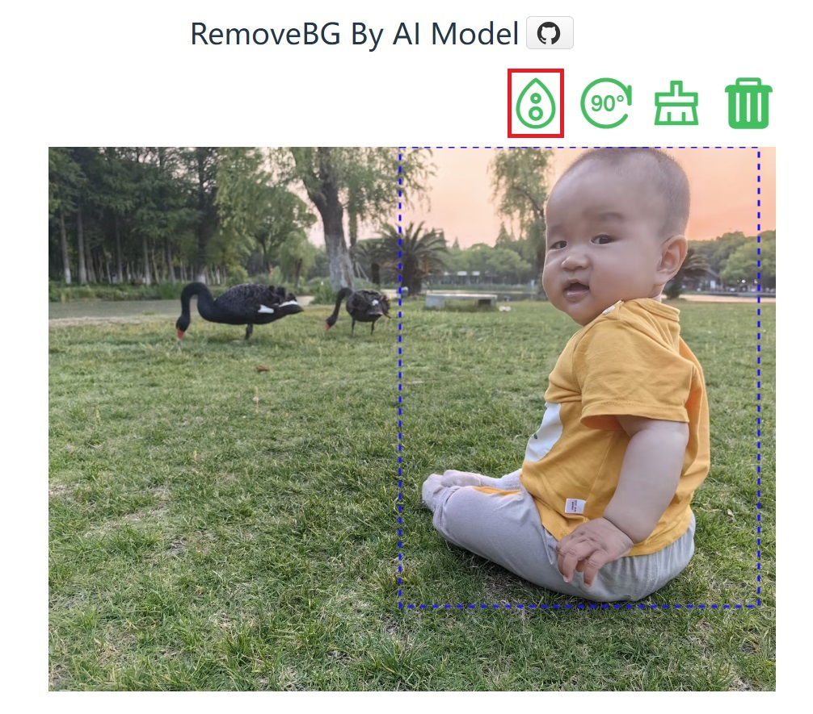
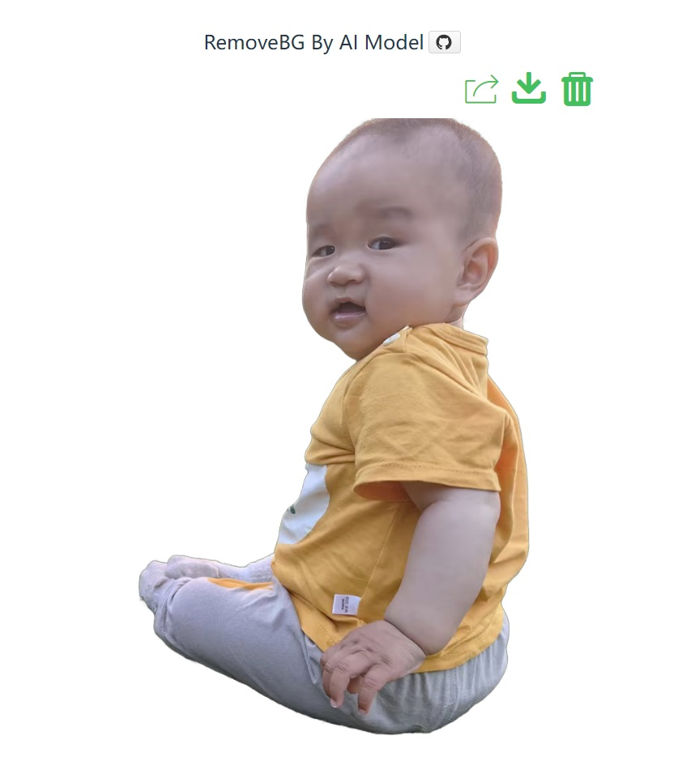

## 项目简介

RemoveBG by AI 是一个利用AI模型对指定图片的指定矩形区域进行抠图，将该区域内的主要单一物体或人物扣取出来，去除背景的工具。该项目使用了 [RMBG-1.4 AI模型](https://huggingface.co/briaai/RMBG-1.4)。

## 效果展示
<p align="center">
    
    
    
</p>

## 功能特性

- 自动识别并抠取指定区域内的主要物体/人物
- 去除背景，使物体/人物更加突出
- 不依赖显卡，可在普通办公电脑上运行
- 提供简单易用的API接口

## 安装与使用

### Windows用户

- 下载打包好的程序
  - [百度网盘](https://pan.baidu.com/s/1feyn1JCC5iy5gi23Jt4haQ) 提取码：1234
  - [Google Drive](https://drive.google.com/file/d/1W6je8T4EFxXuEzbwxn7mcLu9JYQKoNmY/view?usp=sharing)
- 解压文件。
- 运行程序。
- 访问：http://localhost

Windows程序的端口号80，如需修改端，可编辑 `.env` 文件。

### 源码编译

1. 克隆此仓库：

    ```sh
    git clone https://github.com/sssxyd/removebg-by-ai.git
    ```
2. 下载模型，因本账号的LFS配额用完，可从[RMBG-1.4](https://huggingface.co/briaai/RMBG-1.4)，或 [百度网盘](https://pan.baidu.com/s/1pexxJ-ziUvZLLFv7a_zDcQ)提取码1234, 下载模型文件覆盖到model目录

3. 安装运行：
    
    ```sh
    # 确保python版本 >= 3.10
    cd removebg-by-ai
    python -m venv venv
    source venv/bin/activate  # Windows 用户使用 `venv\Scripts\activate`
    pip install -r requirements.txt
   
   python start.py
    ```
    或者使用docker安装

    ```sh
   cd removebg-by-ai
   docker build -t sssxyd/rmbgapi .
   docker run -d -p 80:10086 sssxyd/rmbgapi
   ```


## API接口

### /removebg

- **Method**: POST
- **Content-Type**: application/json
- **Parameters**:
  - `path: str` - 图片的相对地址；path/url/base64三选一
  - `url: str` - 图片的http地址；path/url/base64三选一
  - `base64: str` - 图片的base64格式数据；path/url/base64三选一
  - `selectPolygon: [[x1,y1], [x2, y2], [x3, y3], [x4, y4]]` - 可选，图片上的rectangle四个点的坐标
  - `editorSize: [width, height]` - 可选，框选图片时，图片缩放图的宽度和高度
  - `responseFormat: int = 0` - 返回的数据类型 0/1, 默认0
- **Return**:
  - responseFormat == 0: application/json {code:int, msg:string, result:base64Str}， code == 0 则成功，否则失败
  - responseFormat == 1: image/png字节流
 
### /removebg

- **Method**: GET
- **Parameters**:
  - `url: str` - 图片的http地址
- **Return**:
  - 成功: image/png字节流
  - 失败: application/json {code:int, msg:string} 
  
## 使用示例

```
http://localhost/removebg?url=https://xxx.com/xx.jpg
```

```ts
    const payload = {
        base64: imageBase64,
        selectPolygon: [[100,100], [200,100], [100, 200], [200,200]],
        editorSize: [400, 300],
        responseFormat: 0
    }
    fetch('/removebg', {
        method: 'POST',
        headers: {
            'Content-Type': 'application/json'
        },
        body: JSON.stringify(payload)
    })
    .then(resp => {
        if(resp.status == 200){
            resp.json().then(apiResult => {
                if(apiResult.code != 0){
                    alert(apiResult.msg)
                }
                else{
                    responseImageBase64 = apiResult.result
                }
            }).catch(error => {
                console.log(error)
            })
        }
        else{
            console.error(resp.status + ":" + resp.statusText)
        }
    })
    .catch(error => {
        console.log(error)
    })
```


